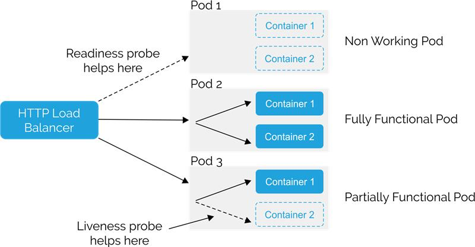

## API Health Checks


### Summary

| Probe Type      | Purpose                                                                 |
|-----------------|-------------------------------------------------------------------------|
| **Liveness**    | Checks if the app is *alive* and should be restarted if unresponsive.   |
| **Readiness**   | Checks if the app is *ready* to receive traffic from the service.       |



---

### Example Setup

Check out the [Infrastructure](../../Infrastructure/Kubernetes.md) section for the DockerFile sample.

.NET Minimal API Example
```csharp
var builder = WebApplication.CreateBuilder(args);
var app = builder.Build();

app.MapGet("/health/live", () => Results.Ok("Alive"));
app.MapGet("/health/ready", () =>
{
    // simulate readiness (e.g. DB check)
    bool dbReady = CheckDatabaseConnection();
    return dbReady ? Results.Ok("Ready") : Results.StatusCode(503);
});

app.Run();

bool CheckDatabaseConnection() => true; // Replace with real check
```
