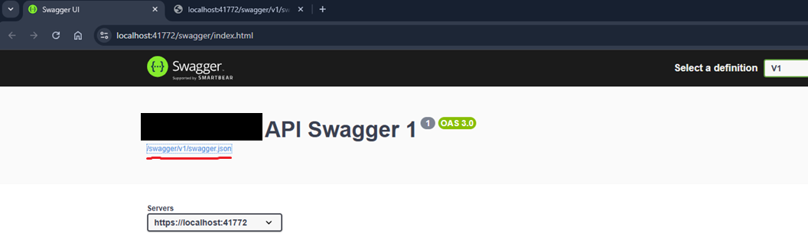
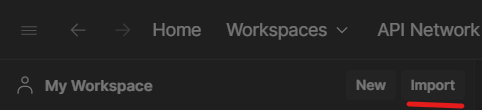
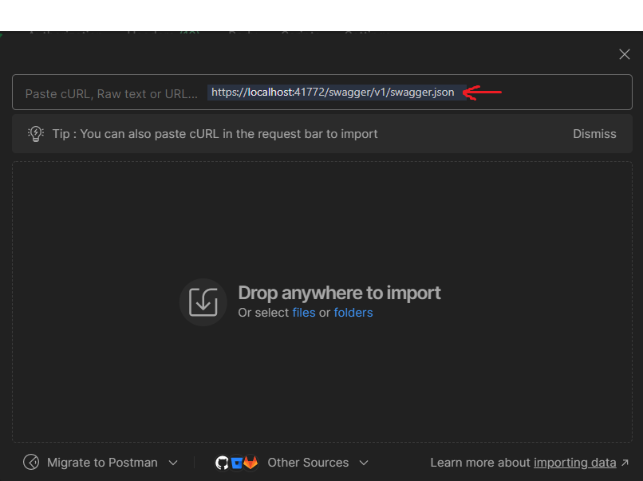
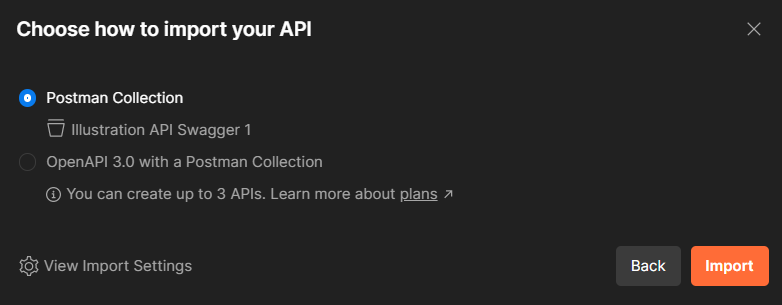

## Automatically Create Postman Collections from OpenAPI/Swagger Specification

Tired of manually creating Postman collections? Now you can use Postman to automatically generate the collection! Simply point it to the OpenApi/Swagger endpoint on your Api! 

### Step 1: Launch API Process with Swagger

Start your API with Swagger Specifications Enabled. In the case of .NET APIs this can be done via configuring the Startup.cs file or Program.cs file if you're using minimal apis.

Minimal Apis
```
  if (app.Environment.IsDevelopment())
  {
    app.UseSwagger();
    app.UseSwaggerUI();
  }

app.MapSwagger(); //.RequireAuthorization()
```

Startup.cs - ConfigureServices()
```

  services
      .AddSwaggerGen(c =>
      {
          c.SwaggerDoc("1.0.0", new OpenApiInfo
          {
              Version = "1.0.0",
              Title = "Swagger Petstore",
              Description = "Swagger Petstore (ASP.NET Core 3.0)",
              Contact = new OpenApiContact()
              {
                  Name = "Swagger Codegen Contributors",
                  Url = new Uri("https://github.com/swagger-api/swagger-codegen"),
                  Email = "apiteam@swagger.io"
              },
              TermsOfService = new Uri("http://swagger.io/terms/")
          });
          c.CustomSchemaIds(type => type.FullName);
          c.IncludeXmlComments($"{AppContext.BaseDirectory}{Path.DirectorySeparatorChar}{_hostingEnv.ApplicationName}.xml");
          // Sets the basePath property in the Swagger document generated
          c.DocumentFilter<BasePathFilter>("/v2");

          // Include DataAnnotation attributes on Controller Action parameters as Swagger validation rules (e.g required, pattern, ..)
          // Use [ValidateModelState] on Actions to actually validate it in C# as well!
          c.OperationFilter<GeneratePathParamsValidationFilter>();
                });
```

Startup.cs - Configure()
```
  app.UseSwagger();
  app.UseSwaggerUI(c =>
  {
      //TODO: Either use the SwaggerGen generated Swagger contract (generated from C# classes)
      c.SwaggerEndpoint("/swagger/1.0.0/swagger.json", "Swagger Petstore");
  });
```



Get the link for the swagger.json file which is generated 

### Step2: Import into Postman

- Open Postman.
- Click on "Import"



- Provide the url for the swagger.json file which was generated in the previous step and viola!




## Step3: Set the collection type

Choose on the imported collections specification. Postman Collection is good enough for our purposes, but the OpenAPI 3.0 option might be better if you want interoperability between different HTTP Client apps such as Postman.



---
