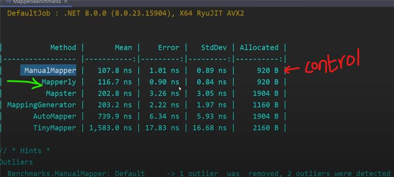

## AutoMapper vs Mapperly

NOTE: AutoMapper is now [PAID](https://www.jimmybogard.com/automapper-and-mediatr-licensing-update/) and no longer Free & Open.  

Compared to Automapper,  Mapperly gives us about a 3-5x improvment.
 


Most development teams use Automapper heavily and it uses reflection which is super slow across the board.

Mapperly uses source generation to create the methods at compile time (vs runtime reflection in Automapper) and is the best out there right now in terms of performance. Better debugging perfomance aswell since its not wrapped up in Automapper magic methods. 

### Implementation
 
In order to implement just add an attribute to the class. Mapperly generates the method. Very simple!

``` 
// Mapper declaration
[Mapper]
public partial class CarMapper
{
   public partial CarDto CarToCarDto(Car car);
}
 
// Mapper usage
var mapper = new CarMapper();
var car = new Car { NumberOfSeats = 10, ... };
var dto = mapper.CarToCarDto(car);
dto.NumberOfSeats.Should().Be(10);
``` 
 
### License
Very permissive , Apache 2.0.


[Github Repository](https://github.com/riok/mapperly)

### Manual Mapping

Honestly at this point, manual mapping might be the best after getting burned by all these open source projects going paid.