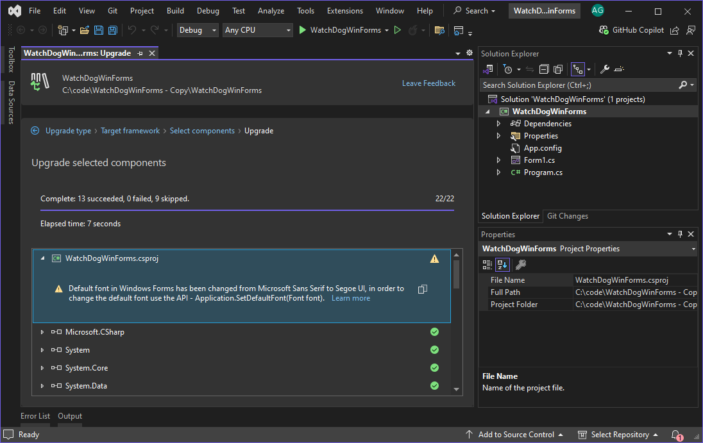

## Automatically Migrate Codebase to Latest .NET

The **.NET Upgrade Assistant** is a powerful tool designed to help you seamlessly **migrate your .NET Framework, .NET Core, or older .NET projects** to the latest version of .NET. Available as both a **Visual Studio extension** and a **command-line interface (CLI)**, it scans your code, flags compatibility issues, and guides you through the upgrade process.

### Key Features

- **Automated Code Analysis**: Identifies 
upgrade needs and generates a comprehensive report.
- **Guided Upgrade Paths**: Provides wizards for full-project or partial upgrades with multiple options.
- **Supports Multiple Project Types**: From ASP.NET and Azure Functions to Xamarin and .NET MAUI.
- **Flexible Upgrade Modes**: Choose between in-place, side-by-side, or incremental upgrades.

### Supported Project Types

- ASP.NET
- Azure Functions
- WPF (Windows Presentation Foundation)
- Windows Forms
- Console Apps
- Class Libraries
- Xamarin Forms → .NET MAUI
- UWP → WinUI 3

### Upgrade Paths

- .NET Framework → .NET
- .NET Core → .NET
- Azure Functions v1–v3 → v4 Isolated (net6.0+)
- Xamarin Forms → .NET MAUI
- UWP → WinUI 3

> 💡 Use Visual Studio 2022 v17.6+ for advanced XAML transformations.

### Upgrade Options

- **In-place**: Directly upgrades the existing project.
- **Side-by-side**: Clones your project and upgrades the copy.
- **Incremental**: Ideal for complex ASP.NET apps. Route some endpoints to the new .NET app while retaining others.

### Interpreting Upgrade Results

| Icon | Status Description |
|------|--------------------|
| ✅ (Unfilled) | Nothing needed to upgrade |
| ✅ (Filled)   | Successfully upgraded |
| ⚠️ Yellow     | Upgraded with warnings |
| ❌ Red        | Upgrade failed          |

Results appear in Visual Studio’s **Upgrade Results** tab and logs are available in the **Output Window** under "Upgrade Assistant".

### PostMigration

Don't forget to **thoroughly test** your application to ensure everything functions as expected post-upgrade.

### References

- [Upgrade projects with .NET Upgrade Assistant](https://learn.microsoft.com/dotnet/core/porting/upgrade-assistant-overview)

---