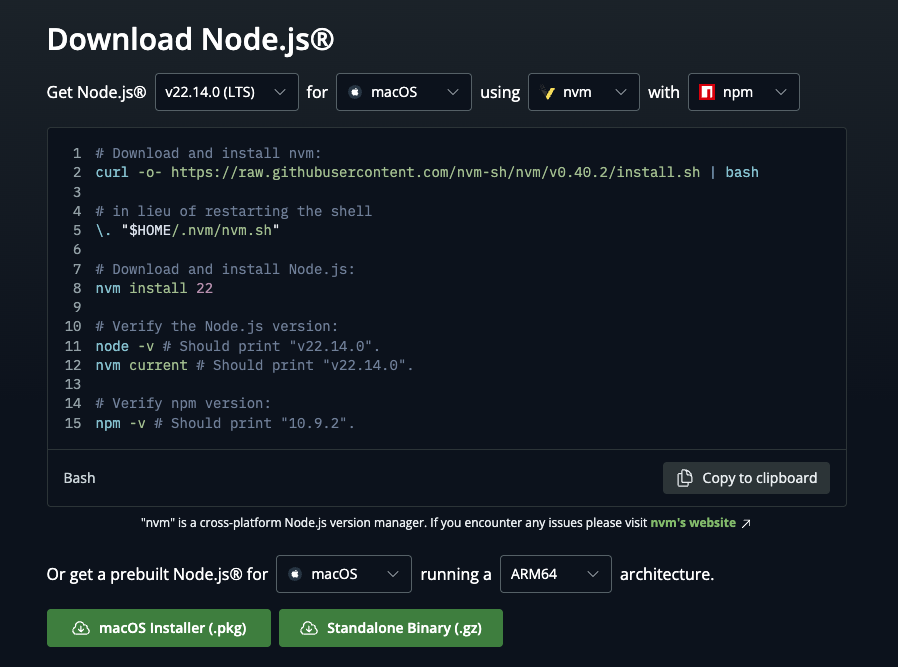
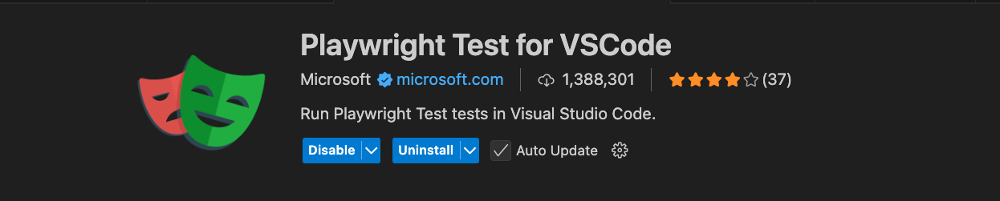
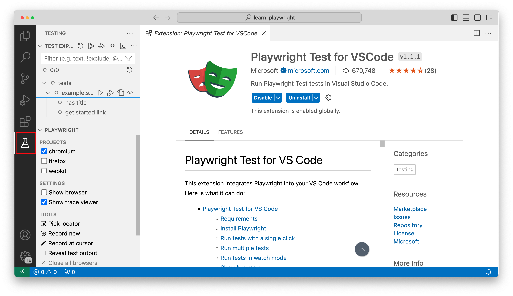
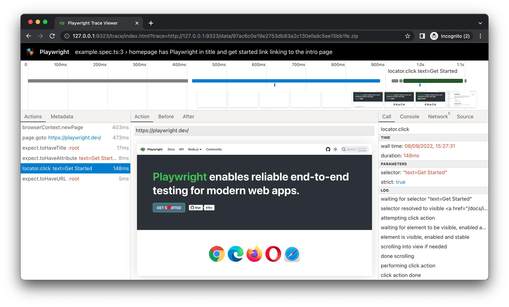

# Playwright Setup Guide

In this guide, we will cover how to setup and configure Playwright for use. Playwright is a powerful framework for end-to-end testing that lets us automate the browser with JavaScript/Typescript.

## Step 1: Download & Install NodeJS

Follow the instructions on the official node.js website for your platform

https://nodejs.org/en/download



## Step 2: Initialize Playwright

Next, we will use npm (node package manager) to initialize Playwright locally. This will use the current folder you are in to download the package etc, so make sure you are in the directory where you want all the project files to lives. 

```
npm init playwright@latest
```


## Step 3: Setup Visual Studio Code

Open Visual Studio Code, click `File > Open Folder`. When asked if you "Trust this folder", click `Yes`.
Next, install the “Playwright Test for VSCode” extension by Microsoft.



The Test Explorer will have a pane for this extension now which will allow us to run, debug, show browser etc.




## Step 4: Update the Playwright Configuration File And Test Scripts
 
Make sure to update the Playwright configuration file according to the recommended values below. This will ensure Playwright interacts correctly with our project.
Here's the recommended configuration (playwright.config.ts):

```
import { defineConfig, devices } from '@playwright/test';
/**
 * Read environment variables from file.
 *  https://github.com/motdotla/dotenv
 */
// import dotenv from 'dotenv';
// import path from 'path';
// dotenv.config({ path: path.resolve(__dirname, '.env') });
/**
 * See  https://playwright.dev/docs/test-configuration.
 */
export default defineConfig({
  // Folder for test artifacts such as screenshots, videos, traces, etc.
  outputDir: './test-results',
  testDir: './tests',
  /* Run tests in files in parallel */
  fullyParallel: true,
  /* Fail the build on CI if you accidentally left test.only in the source code. */
  forbidOnly: !!process.env.CI,
  /* Retry on CI only */
  retries: process.env.CI ? 2 : 0,
  /* Opt out of parallel tests on CI. */
  workers: process.env.CI ? 5 : 5,
  /* Reporter to use. See  https://playwright.dev/docs/test-reporters */
  reporter: [['list'], ['line'], ['html', { open: 'always'}],   ['json', {  outputFile: './test-results-json/test-results.json' }], ['junit', { outputFile: './results.xml' }]],
  /* Shared settings for all the projects below. See  https://playwright.dev/docs/api/class-testoptions. */
  use: {
    /* Base URL to use in actions like `await page.goto('/')`. */
    // baseURL: 'http://127.0.0.1:3000',
/* Collect trace when retrying the failed test. See  https://playwright.dev/docs/trace-viewer */
    trace: 'on',
    screenshot: 'only-on-failure',
    video: 'retain-on-failure',
    viewport: { width: 1920, height: 1080 },
  },
/* Configure projects for major browsers */
  projects: [
    {
      name: 'chromium',
      use: { ...devices['Desktop Chrome'] },
    }
// {
    //   name: 'firefox',
    //   use: { ...devices['Desktop Firefox'] },
    // },
// {
    //   name: 'webkit',
    //   use: { ...devices['Desktop Safari'] },
    // },
/* Test against mobile viewports. */
    // {
    //   name: 'Mobile Chrome',
    //   use: { ...devices['Pixel 5'] },
    // },
    // {
    //   name: 'Mobile Safari',
    //   use: { ...devices['iPhone 12'] },
    // },
/* Test against branded browsers. */
    // {
    //   name: 'Microsoft Edge',
    //   use: { ...devices['Desktop Edge'], channel: 'msedge' },
    // },
    // {
    //   name: 'Google Chrome',
    //   use: { ...devices['Desktop Chrome'], channel: 'chrome' },
    // },
  ],
/* Run your local dev server before starting the tests */
  // webServer: {
  //   command: 'npm run start',
  //   url: 'http://127.0.0.1:3000',
  //   reuseExistingServer: !process.env.CI,
  // },
});
```

Refer to the full configuration above to adjust according to your specific project needs. 

Note: By default this configuration will take screenshots on error, record traces, use chrome to run in desktop mode.


## Step 5: Execute Tests
The tests can be executed using the Test Explorer tab in Visual Studio code. You can also check the "Show Browser" checkbox to show the browser during execution, or else it will run in headless mode.
You can execute the test files located in the default tests folder (./tests) via the command line as follows:
 
```
npx playwright test
```


Moreover, the execution report should open automatically but you can manually open it with:

```
npx playwright show-report
```

To view the html report, navigate to the url in the browser.

Trace is also be enabled in the configuration to get detailed screenshots/state of the browser with a timeline.
Each test case will have a trace attached which shows the browser state any point in time via a timeline view, great for debugging:



The JSON Report will contain the test results (duration etc) in a JSON format.

## Step 6: Advanced Test Execution
For parallel execution and repeating of tests, use:
```
npx playwright test --repeat-each=30 --workers=5 
```

This command implies that tests should be repeated 30 times, while running 5 of them in parallel worker threads.

## Wrap-up
After completing these steps, you should now be ready to make full use of Playwright for rigorous and reliable end-to-end testing. Be sure to regularly consult Playwright's documentation to take full advantage of its robust and flexible functionality.
 
[Official Playwright Documentation](https://playwright.dev/)

---
