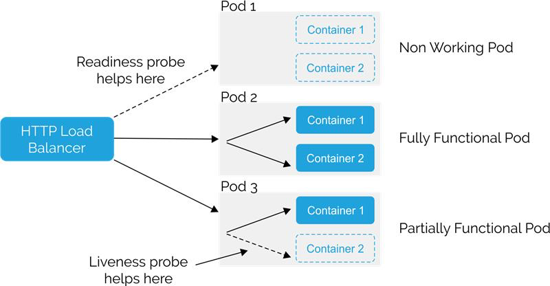

## API Health Checks


### Summary

| Probe Type      | Purpose                                                                 |
|-----------------|-------------------------------------------------------------------------|
| **Liveness**    | Checks if the app is *alive* and should be restarted if unresponsive.   |
| **Readiness**   | Checks if the app is *ready* to receive traffic from the service.       |




### Example

#### Dockerfile

```dockerfile
HEALTHCHECK --interval=30s --timeout=10s --start-period=5s --retries=3 \
  CMD curl --fail http://localhost:5000/health/live || exit 1
```

#### Kubernetes

```yaml
livenessProbe:
  httpGet:
    path: /health/live
    port: 5000
  initialDelaySeconds: 10
  periodSeconds: 15

readinessProbe:
  httpGet:
    path: /health/ready
    port: 5000
  initialDelaySeconds: 5
  periodSeconds: 10
```