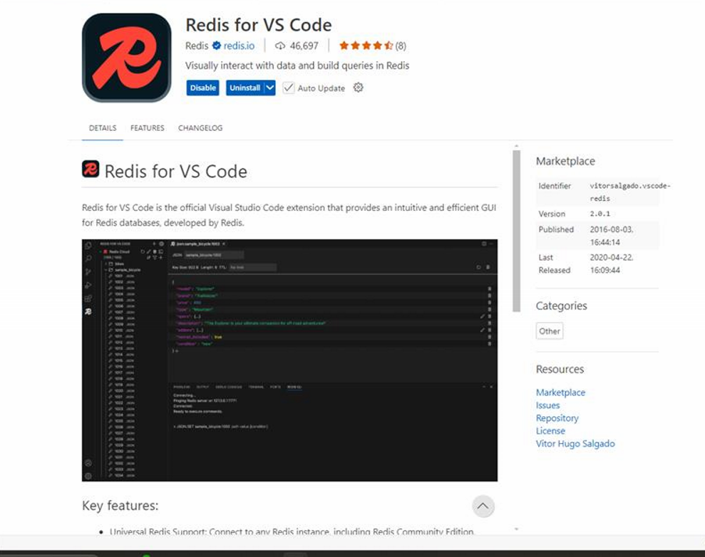
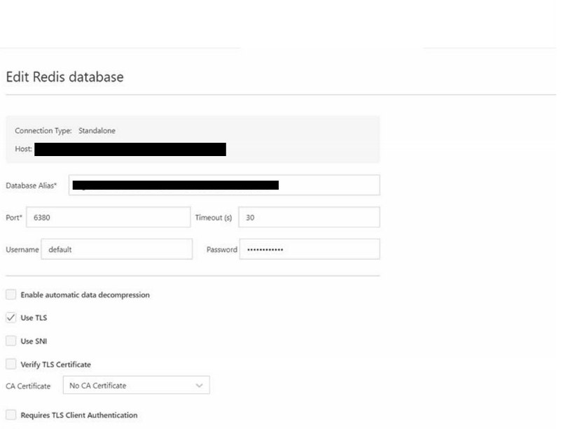
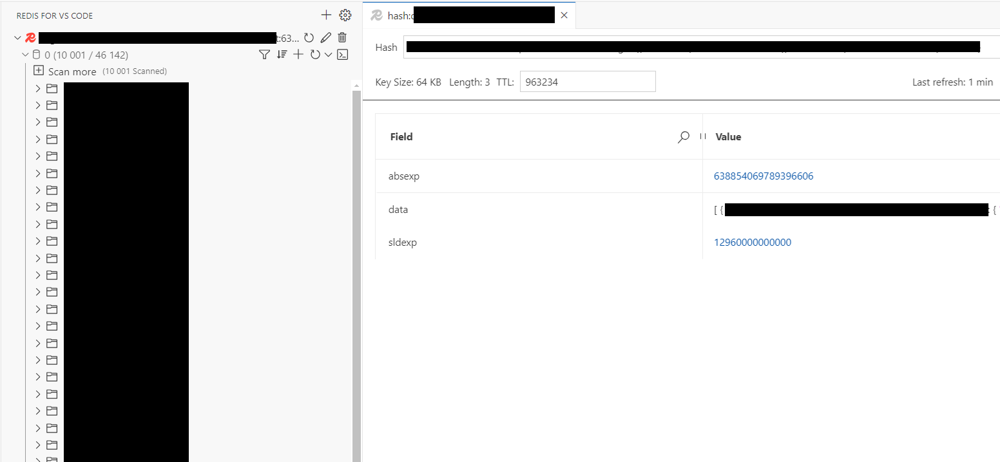

## GUI Visualization of Cached Data in Redis

Download the "Redis for VS Code" extension (official by Redis - the company)
 

 
Configure the connection

Note: Redis default port is 6380 and the default username is "default"

You'll see a neatly organized list of cache key prefixes! Enjoy

